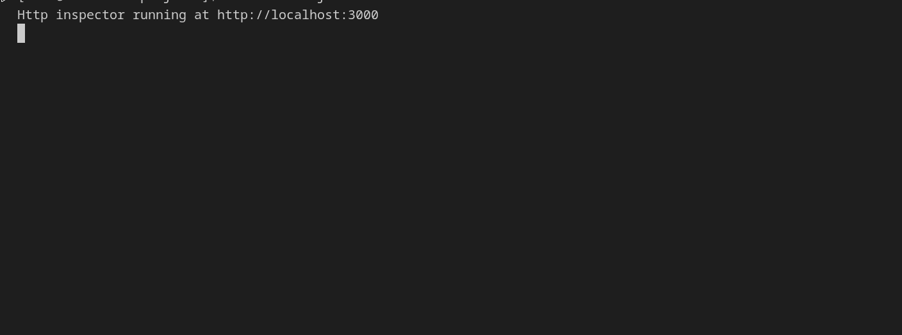
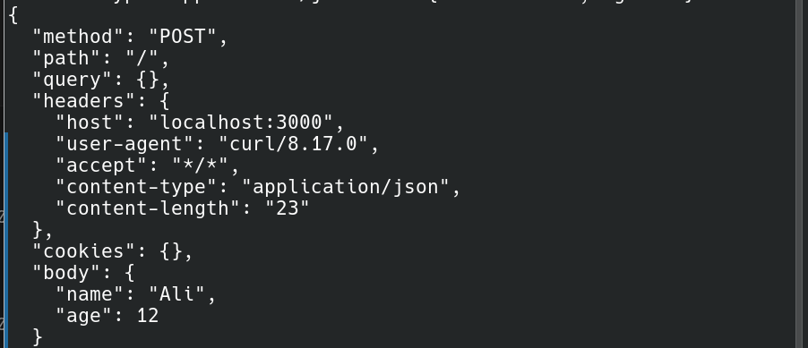

#  Raw HTTP Inspector API
-A simple HTTP inspector server built with Node.js without any external dependancies
# Purpose
this project shows you
1.How http works internally
2.where data can be injected
3.How servers parse requests

# Features
this projects extract some features;
1.Http method
2.Header inspection
3.Query inspection
4.Cookies inspection
5.Body inspection

# To run program; run program in vsc then go to another konsole like that on linux and run this line 
1.curl "http://localhost:3000/inspect?name=john&age=12"
or using ;
curl -X POST http://localhost:3000 \
-H "Content-Type: application/json" \
-d '{"name":"john","age":12}'
--
notes;
-H -> stands for header content
-d -> body content 

the output of the project after I put into the terminal the second command;

